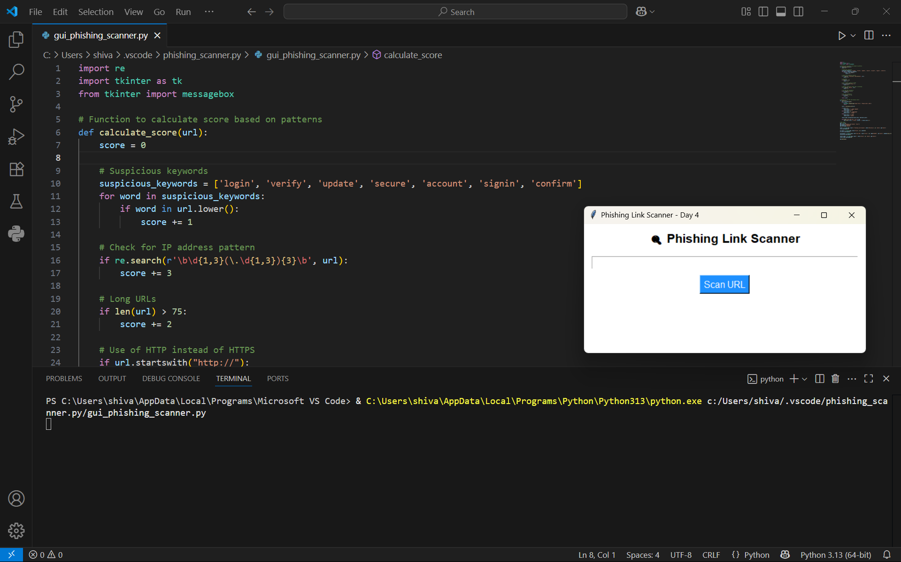
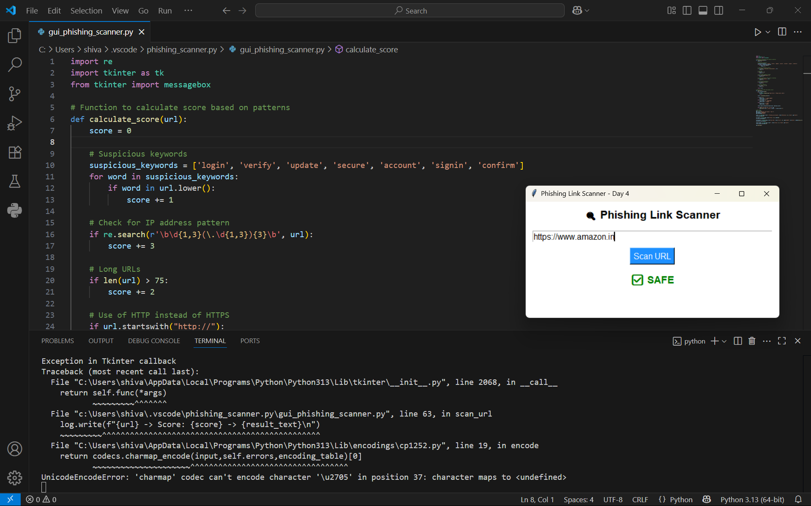
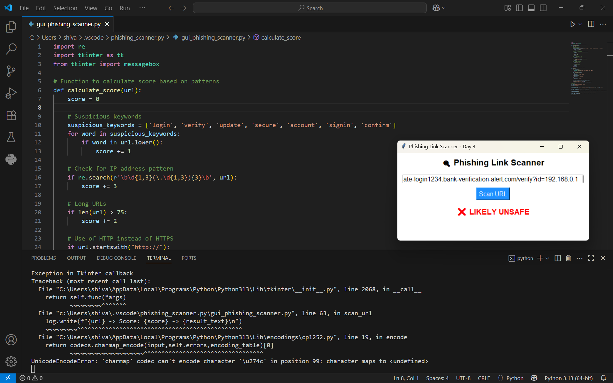

# Phishing Link Scanner - Brainwave Matrix Internship Project

This is a GUI-based **Phishing Link Scanner** built using Python.  
The tool helps detect whether a given URL is **safe** or **phishing/fake**, based on pattern matching and scoring of suspicious traits.

---

##  Features

-  Detects if a link is **legit or suspicious**
-  Uses simple rules to **score** the link (no external APIs used)
-  Built with **Tkinter GUI** (user-friendly interface)
-  Score-based detection logic (Day-wise improvements)
-  Includes screenshots of working output

---

##  Technologies Used

- **Python**
- **Tkinter** (built-in GUI library)
- Basic string and URL analysis (no external API or ML)

---

##  How to Run This Project

1. **Install Python**
2. Clone or download this repo
3. Run the script using:

```bash
python src/phishing_link_scanner.py

## GUI WINDOW


## SAFE_URL


## UNSAFE_URL



